# schema-collaboration: documentation for data managers

## Introduction
schema-collaboration is a tool in the form of web platform to help data managers and researchers to collaborate to create Frictionless datapackages. 

In order to use this application some familiarity with Frictionless Datapackages is required. You can find information on the [Frictionless website](https://frictionlessdata.io/) or the [Data Package specification](https://specs.frictionlessdata.io/data-package/).

schema-collaboration uses [datacreator-ui](https://github.com/frictionlessdata/datapackage-ui): see the [datacreator-ui demo](https://create.frictionlessdata.io/).

It was funded by Frictionless Data Tool Fund 2020. There is a [blog with the initial description](https://frictionlessdata.io/blog/2020/07/16/tool-fund-polar-institute/#meet-carles-pina-estany).

## Overall steps to use schema-collaboration
The documentation give a detailed steps with screenshots on how to use schema-collaboration. The general ideas covered are:
 * Install the application
 * Login as a data manager
 * Create a Datapackage and add the known information (title, authors, etc.)
 * Create a Person
 * Edit the Datapackage and add the created person as a collaborator
 * Send the link to the Datapackage to the collaborators so they can work on it
 * At any time add comments to the datapackage to be seen either by you only or by the collaborators as well

## Installation
schema-collaboration needs to be installed into a server in order to be used by the data manager and researchers. It is done in Python and Django and there are different ways to set it up:
 * Using a Python virtual environment (see the documentation in the main README file)
 * Using Docker and a sqlite3 database
 * Using Docker and a MariaDB database server (not included)

We have tried to make schema-collaboration easy to test without having the setup a database. Someone with certain familiarity to the shell with either Docker or Python3 installed should be able to install schema-collaboration in their computer to be used locally.

In order to install schema-collaboration on a server to be used in production a system administrator will need to help to integrate with existing infrastructure (DNS, existing servers, virtual hosts, backups, existing database, etc.).

We have tried to make schema-collaboration easy to deploy. Let us know if you need anything implemented in schema-collaboration that would make deploying it for you easier and we will consider this.

schema-collaboration stores the Data package schemas but not research data. This is to keep the installation and administration of the application as easy as possible. It might be added in the future.

## User account types
There are three different roles in the application:
 
 * *Data manager users:* they have access to the "management" area with individual login and password. All data manager users have access to the same data sets. The login link is in the main page and the username and password created during the installation
 * *Admin user:* this user, using the Django admin web section, can add or remove different status of the data packages and do other actions that are not exposed to the data managers (for example delete or modify comments, delete data packages, etc.)
 * *Researchers:* they do not need any login/password. The data managers will send unique links to them in order to access their datasets. The system is designed this way to avoid creating users, making them keep/recover password, etc.

## Data manager login into schema-collaboration
After the installation of the schema-collaboration in the main page there is a link to the management area. The URL of the schema-collaboration will vary depending on the installation methods but it will like:
 * [http://localhost:8000](http://localhost:8000) if it was installed in the local computer in the port 8000 (default if following the instructions)
 * [https://schema-collaboration.yourinstitution.org](https://schema-collaboration.yourinstitution.org) (or similar) if it was installed in one of your servers

In the main page follow the link to the "management area":

| 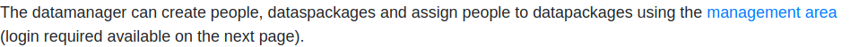 |
|---|

After this please login using your credentials:

| 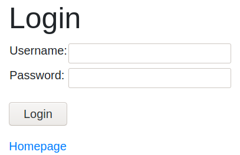 |
|---| 

The username and password for the datamanager were created during the installation. Please refer to the installation steps to find them.

## Navigation
There is a left-hand side bar to navigate between "Datapackages" and "People". It also shows the user that is logged-in and allows to "Logout". See the options:

| 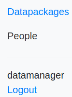 |
|---|

## Create the first datapackage
The first time that a data manager logins in the system there will be no packages created. The datamanager needs to create a new data package to fill-in with the basic information.

Create the button "Create a Datapackage" in order to create one:

| 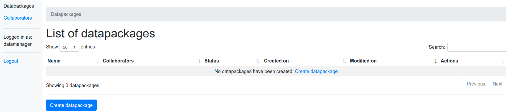 |
|---|

It will create a new, empty, data package and it will open the Data Package Creator:

| 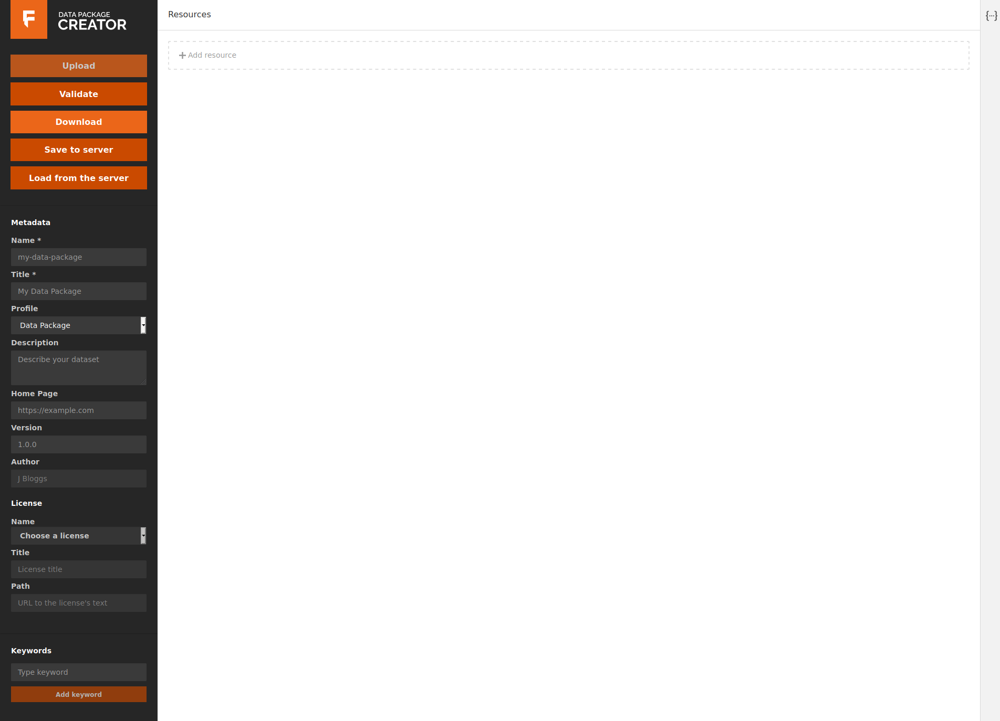 |
|---|

As a data manager fill in all the information that you might know of the data set.

At any time or when finished select "Save to server".

Then select "List of datapackages" (TODO 2020-10-20: button to be added!) 

The list of datapackages will contain the new datapackage:

| 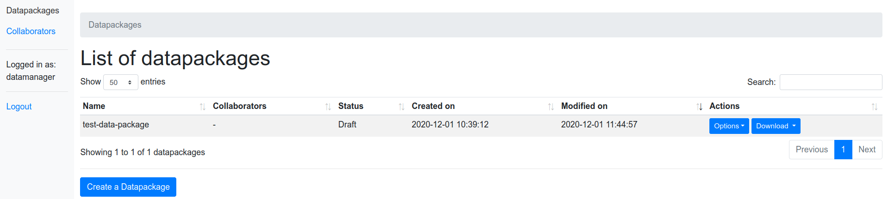 |
|---|

## Create the first Person
In order to give access to the researchers it is needed to create "People" (TODO 2020-10-20 rename to collaborators?)

Select "People" on the left hand side bar:

| 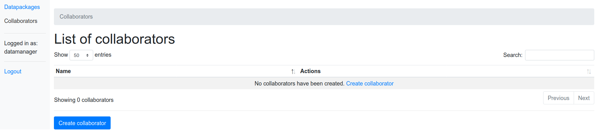 |
|---|

Select "Create a Person" and enter the person's name:

| 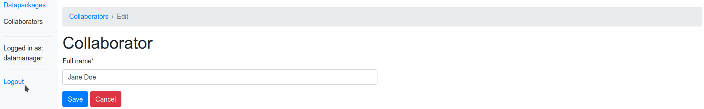 |
|---|

schema-collaboration will show the "Person detail" page:

| 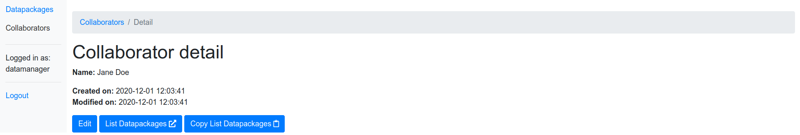 |
|---|

There are three buttons on above screenshot:
 * "Edit": to edit the person (change the name)
 * "List Datapackages": takes you to the list of datapackages assigned to this user
 * "Copy List Datapackages": copies the link to the datapackages to your clipboard.
 
 If we open the "List Datapackages" (for this user) it is empty:

|  |
|---|

Note that this page doesn't have the left hand side bar. This is because the external pages (available to collaborators) do not have it and the URL can be sent to the collaborators in order to work on it.

## Assign a datapackage to a researcher
Select "Datapackages" on the left hand side and then "Options -> Manage Datapackage":

| 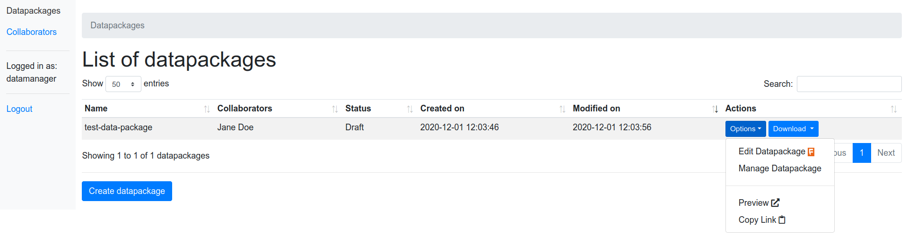 |
|---|

There is a brief information on the datapackage detail. Here is where you could add Comments for the researchers of for yourself (enable "Private" if the comment is only for you).

Select "Edit Manage" in order to Manage the Datapackage:

| 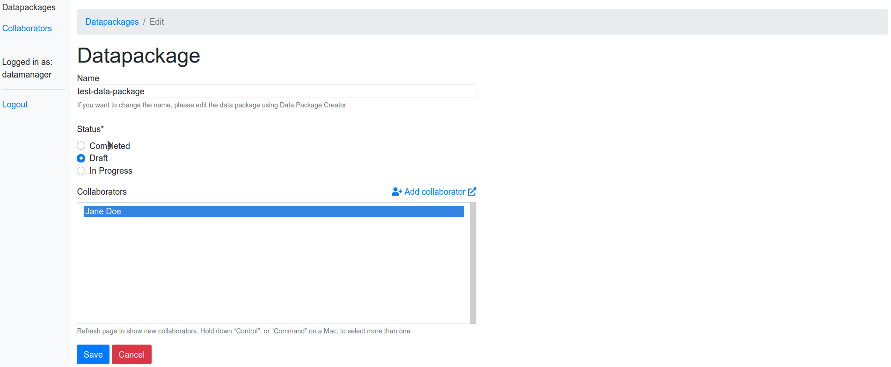 |
|---|

In this page you are able to Edit this datapackage: change its status and add collaborators. In this case we are adding the "Jane Doe" collaborator and selecting "Save".

After this select "Datapackages" again you can see the "List of Datapackages" and the "Collaborators" column has "Jane Doe":

| 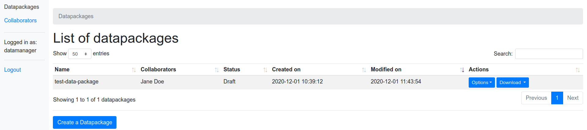 |
|---|

## Options in a Datapackage
Each Datapackage has a different set of options:

|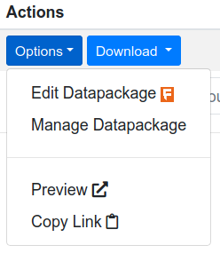|
|---|

 * Edit Datapackage: takes you to the "Datapackage creator" in order to make changes to the data package
 * Manage Datapackage: place to add comments and also to edit the datapackage collaborators and status of the datapackage
 * Collaborator View: takes to the accessible without login/password page: this is to be sent to the collaborators. Collaborators can read and write comments, datapackage information, Edit it and Download it

## Download button
The "Download" button appears in different pages with always the same options:

| 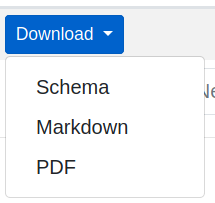 |
|---|

 * Schema: downloads the JSON schema file
 * Markdown: generates a documentation file formatted on Markdown based on the Schema
 * PDF: generates a PDF file from the Markdown
 
 All the Markdown and PDF information comes from the Schema.
 
An example of the PDF output:

## Collaborator access
The collaborators can have access to the datapackages via two type of links:
 * Datapackage link: give access to one datapackage
 * Collaborator link: all the datapackages for the collaborator will appear and the collaborator can choose which one to work on

The public link to a single datapackage can be found in the "Options" in the List of Datapackages.

The public link to all the datapackages for a given users can be found in the "List of People" and the name is "List Datapackages".

Collaborators don not need a username/password: the unique links are enough to access there.

## Admin access and operations
All the day-to-day operations can be done by the datamanagers in the management area. There available access to the Django standard "admin" panel to do some other operations like:
 * Create other datapackage status. By default "Draft", "In Progress" and "Completed" are created. You can modify these ones or add other status and will appear in the "Manage datapackage". For example "Published", "Waiting for Data", "Embargo", etc.
 * Delete datapackages (it is not possible yet in the management section but in the admin section it is possible)
 * Delete or modify comments
 * Delete people
 * Create other data manager users

To access the admin panel use an URL like [http://localhost:8000/admin](http://localhost:8000/admin) (change http://localhost:8000 as needed in your installation). Then you will need to enter the "Django administration" username and password. This is the `admin` user that got created when schema-collaboration was initially installed.

If you don't know the admin username and password anymore you can create/setup a new one using `python3 manage.py changepassword admin` (see [Django documentation for changing the password](https://docs.djangoproject.com/en/3.1/topics/auth/default/#changing-passwords) or [how to create another admin user](https://docs.djangoproject.com/en/3.1/topics/auth/default/#creating-superusers))

The admin section list of packages looks like:

| 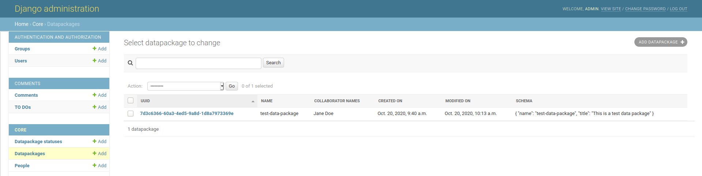 |
|---|

### Create more Datapackage Status
On the left hand side select "Datapackage status" to list the Datapackage status:

| 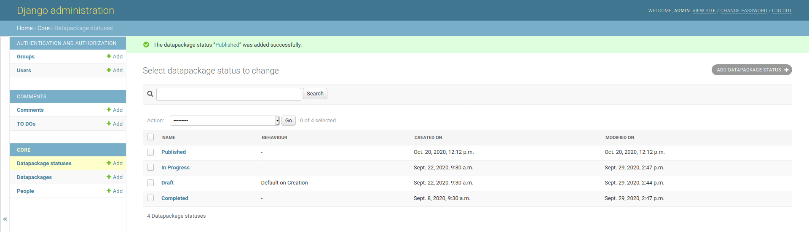 |
|---|

Then on the "Add datapackage status" to load the form:

| 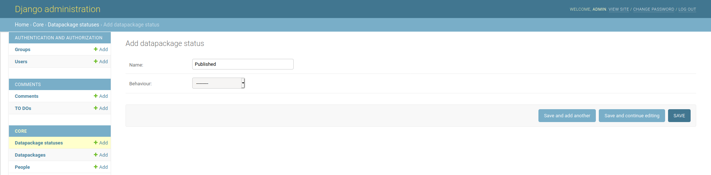 |
|---|

Enter the new datastatus name (in the example "Published") and select "Save".

"The Behaviour": currently there is only one possible "Behaviour": "Default on creation". The status of a new, rjust created, datapackage will be the status that has "Default on creation". Only one Status can have the Behaviour "Default on creation".

### Delete People
Select on "People" on the left hand side and fine the Person or People to be deleted. You can use the "Search" feature if needed. Select the checkboxes and then the action "Delete selected People":

| 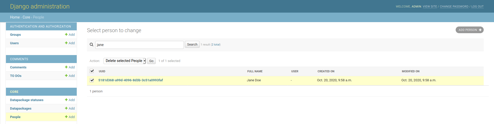 |
|---|

If this person is a collaborator in some Datapackages it will be de-attached and you might need to confirm it select on "Yes, I'm sure":

| 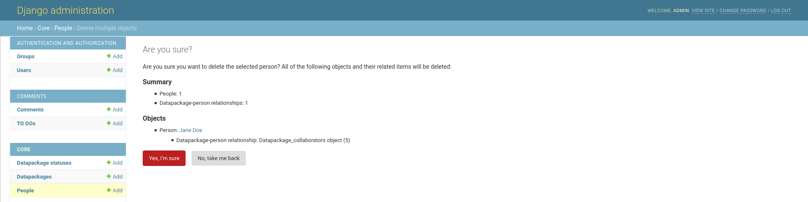 |
|---|

These steps are the same for deleting a Datapackage or a Comment.

### Other operations
Other operations in the admin: just navigate on the left hand side to Comments and use it to modify, delete or add objects as needed.
